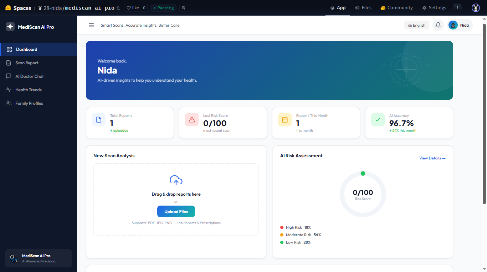
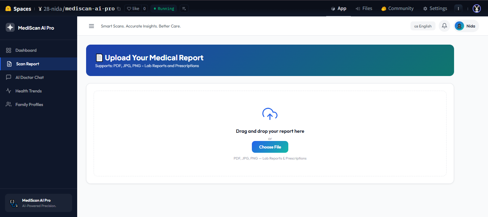
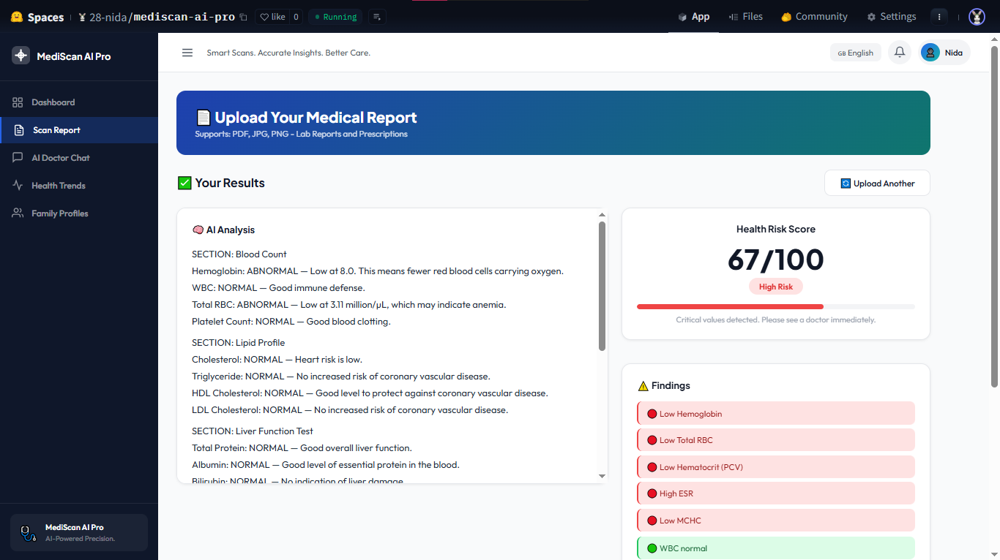
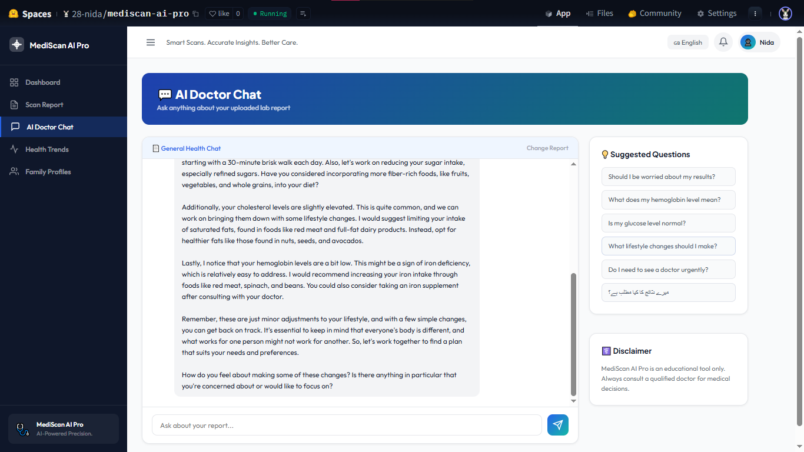

# MediScan AI Pro 🏥🤖

> **Pakistan's first bilingual AI-powered health companion for lab report understanding.**

Millions of Pakistanis receive lab reports and prescriptions every day but can't understand them. Doctors are too busy to explain. MediScan AI Pro bridges that gap — making healthcare understandable for everyone, in Urdu and English.

[](https://huggingface.co/spaces/28-nida/mediscan-ai-pro)
[](https://github.com/Nida-creator/mediscan-ai-pro)
[]()
[]()

---

## Screenshots






---

## 📌 What It Does

MediScan AI Pro lets users upload a lab report or prescription (PDF or image) and instantly receive:

- 🔬 **Plain-language explanation** of test results — no medical jargon
- 📊 **Risk score (0–100)** indicating overall health concern level
- 🩺 **Doctor-style conversational chat** to ask follow-up questions
- 🌐 **Bilingual support** — responses in both Urdu and English
- 📄 **Report summary generation** for easy sharing

---

## 🎯 Problem Statement

Pakistan has over 230 million people. Most receive lab reports they cannot interpret. Specialist consultations are expensive, inaccessible, or require long waits. There is no accessible, free, AI-powered solution that explains medical results in plain Urdu or English — until now.

---

## 🏗️ Architecture

```
User uploads PDF / Image
        ↓
OCR (Tesseract) extracts text
        ↓
RAG Pipeline retrieves medical context
        ↓
LLaMA 3.3 70B (via Groq API) analyzes report
        ↓
Risk score + plain-language explanation generated
        ↓
Doctor-style chat enabled (Bilingual: Urdu + English)
        ↓
Deployed on HuggingFace Spaces (Flask + Docker + GitHub CI/CD)
```

---

## 🛠️ Tech Stack

| Layer | Technology |
|---|---|
| AI Model | LLaMA 3.3 70B via Groq API |
| AI Support | Gemini API |
| RAG Pipeline | Hugging Face Transformers |
| OCR | Tesseract |
| Backend | Flask, Python, REST API |
| Frontend | HTML5, CSS3, JavaScript |
| Deployment | Docker, GitHub CI/CD, HuggingFace Spaces |
| Languages | Urdu + English (bilingual) |

---

## 🔐 Security

- All API keys stored in `.env` — never hardcoded
- Input validation on all uploaded files
- Secure file processing pipeline
- No user data retained after session

---

## 📁 Project Structure

```
mediscan-ai-pro/
├── app.py              # Flask application entry point
├── requirements.txt    # Python dependencies
├── Dockerfile          # Docker configuration
├── .env.example        # Environment variable template
├── static/             # Frontend assets
├── templates/          # HTML templates
└── utils/              # OCR, RAG, and AI pipeline modules
```

---

## 🏆 Achievements

- 🥇 Built and deployed at **National Hackathon 2025** — presented to industry panel
- 🚀 Live in production on **HuggingFace Spaces** with real users
- 🌐 Pakistan's first bilingual (Urdu + English) AI health companion
- ⚡ Complete end-to-end pipeline delivered within a **3-day hackathon sprint**

---

## 👩‍💻 Developer

**Nida Nadeem**
BS Computer Science — LCWU, Lahore, Pakistan
- 🔗 [LinkedIn](https://linkedin.com/in/nidanadeem-)
- 🐙 [GitHub](https://github.com/Nida-creator)
- 📧 nnida853@gmail.com

---

## 📄 License

This project is licensed under the MIT License.

--- 

> *"Healthcare information should be accessible to everyone — regardless of language, literacy, or income."*
